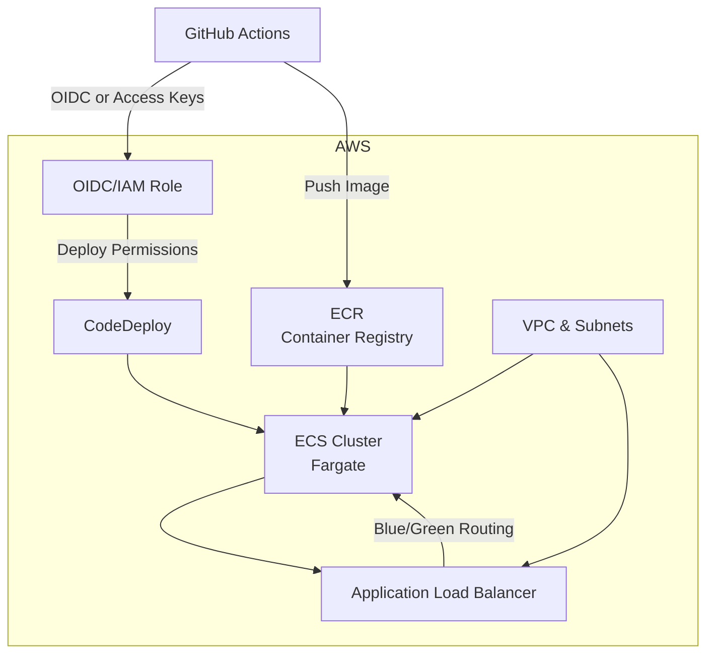

# a_b_deployment

Minimal FastAPI app with blue/green deployment on AWS ECS using Terraform and GitHub Actions.

## Overview

This project demonstrates a production-grade deployment pipeline for a Python FastAPI application using:

- **AWS ECS (Fargate)** with blue/green deployment via CodeDeploy
- **Terraform** for infrastructure as code
- **GitHub Actions** for CI/CD
- **AWS ECR** for container image storage
- **OIDC/IAM** for secure GitHub-to-AWS deployments

---

## Directory Structure

```
a_b_deployment/
  app/            # FastAPI application code & Dockerfile
  infra/          # Terraform infrastructure code
    envs/prod/    # Production environment configuration
    modules/      # Reusable Terraform modules (network, ecr, ecs, oidc)
  .github/        # GitHub Actions workflows
```

---

## Architecture Diagram



---

## Deployment Flow

1. **Code Push**: Developer pushes code to `main` branch.
2. **CI/CD Trigger**: GitHub Actions workflow runs:
   - Builds and tests the FastAPI app.
   - Builds Docker image and pushes to AWS ECR.
   - Applies Terraform to provision/update infrastructure.
   - Registers new ECS task definition with the new image.
   - Triggers CodeDeploy blue/green deployment to ECS Fargate.
3. **Blue/Green Deployment**:
   - CodeDeploy shifts traffic from the old (blue) to the new (green) ECS service.
   - ALB routes traffic based on deployment state.
4. **Rollback**: If health checks fail, CodeDeploy can automatically rollback.

---

## Infrastructure Highlights

- **Terraform Modules**: Modularized for network, ECR, ECS, and OIDC/IAM.
- **State Management**: Remote state stored in S3.
- **Security**: GitHub Actions uses OIDC or access keys for AWS authentication.
- **Outputs**: Key resources (ALB DNS, ECR repo, ECS cluster/service names) are exported for use in CI/CD.

---

## Getting Started

1. **Clone the repo** `git clone https://github.com/JATINKUMAR1008/Blue-green-deployemnt`
2. **Set up AWS credentials**Configure secrets in GitHub for AWS access or OIDC.
3. **Configure Terraform backend**Edit `infra/envs/prod/main.tf` for your S3 bucket and region.
4. **Push to main**
   The CI/CD pipeline will build, test, and deploy automatically.

---

## References

- [FastAPI Documentation](https://fastapi.tiangolo.com/)
- [Terraform AWS Provider](https://registry.terraform.io/providers/hashicorp/aws/latest/docs)
- [GitHub Actions](https://docs.github.com/en/actions)
- [AWS ECS Blue/Green Deployments](https://docs.aws.amazon.com/codedeploy/latest/userguide/deployment-steps-ecs.html)
