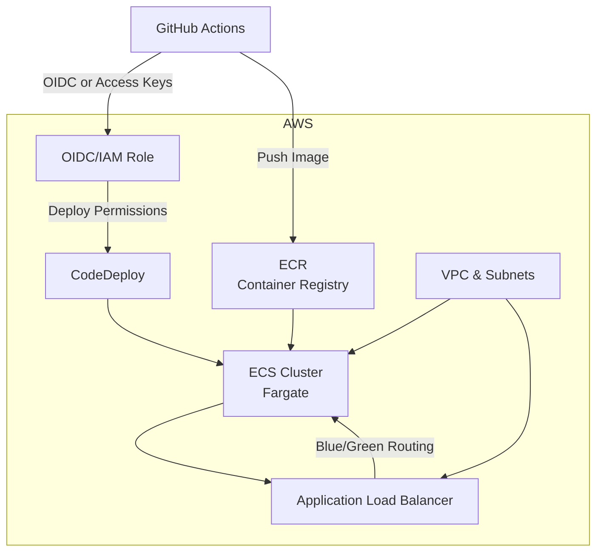

# blue_green_deployment

Production‑ready FastAPI service deployed with blue/green on AWS ECS Fargate using Terraform and GitHub Actions.

## Overview

- AWS ECS Fargate with CodeDeploy blue/green traffic shifting behind an ALB
- Terraform IaC with reusable modules (network, ECR, ECS blue/green, IAM/OIDC)
- GitHub Actions CI/CD building and pushing images to ECR and creating CodeDeploy deployments
- CloudWatch Logs and ALB 5xx alarms to trigger automatic rollback

## Skills Demonstrated

- Infrastructure as Code with Terraform modules and remote S3 backend
- Containerized app packaging with multi‑stage Dockerfile and non‑root runtime
- AWS IAM least‑privilege, OIDC or access key auth for CI, and managed policy usage
- Blue/green strategy on ECS with dual target groups and CodeDeploy deployment configs
- GitHub Actions workflow design (caching, deterministic tooling setup, safe rollouts)

## Repository Layout

```
a_b_deployment/
  app/            FastAPI app, tests, Dockerfile
  infra/
    envs/prod/    Environment entrypoint (S3 backend, variables, module wiring)
    modules/      Reusable Terraform modules (network, ecr, ecs-bluegreen, iam-oidc)
  .github/
    workflows/    CI/CD pipeline (build, push, deploy)
```

## Architecture



## What Terraform Creates

- VPC with public subnets and security groups for ALB and ECS service
- ECR repository for the application image
- ECS cluster, task definition, and service (Fargate launch type)
- ALB with two target groups (blue/green) and HTTP listener
- CodeDeploy application and deployment group targeting the ECS service
- CloudWatch log group for the app and ELB 5xx alarms for rollback
- IAM roles for task execution, task role, and CodeDeploy with needed policies

Key module outputs are exported from `infra/envs/prod/outputs.tf` and consumed by CI: `alb_dns`, `ecr_repo`, `cluster_name`, `service_name`, `task_family`, `cd_app`, `cd_group`.

## Prerequisites

- AWS account and credentials with permissions to create the above resources
- S3 bucket for Terraform backend; update `infra/envs/prod/main.tf:4` with your bucket name
- GitHub repository secrets configured (choose one auth method):
  - OIDC: `AWS_OIDC_ROLE_ARN`
  - Access keys: `AWS_ACCESS_KEY_ID`, `AWS_SECRET_ACCESS_KEY` (and optional `AWS_SESSION_TOKEN`)

## CI/CD Pipeline

Workflow file: `.github/workflows/ci-cd.yml`

High‑level steps:
- Setup Terraform and AWS credentials
- Initialize/optionally apply Terraform to ensure infra exists
- Read Terraform outputs for later steps
- Login to ECR, build and push image tagged with commit SHA
- Register new ECS task definition from the previous one with the new image
- Create a CodeDeploy deployment using an AppSpec payload
- Wait for deployment success; emit summary with ALB URL

Notes:
- The deployment group uses `CodeDeployDefault.ECSAllAtOnce` by default. You can switch to a linear/canary strategy.
- The workflow uses AppSpec‑based `--revision` for broad CLI compatibility instead of `--target-input`.

## Application

- Framework: FastAPI, served by `uvicorn`
- Health endpoints: `GET /healthz/live`, `GET /healthz/ready`
- Default port: `8000` (configurable via Terraform `container_port`)
- Logs: CloudWatch Logs group `/ecs/<service-name>`

The ECS container health check calls: `curl -fsS http://localhost:8000/healthz/live`. The runtime image installs `curl` so this succeeds during container startup.

## Operating Blue/Green

- Two target groups (blue, green); CodeDeploy shifts traffic via the ALB listener
- Alarms on ALB Target 5xx for both target groups trigger automatic rollback
- Container health check has `startPeriod` of 10s; you can increase to reduce false negatives during cold start

## Getting Started

- Clone: `git clone https://github.com/JATINKUMAR1008/Blue-green-deployemnt`
- Update backend: `infra/envs/prod/main.tf:4` to point to your S3 bucket/region
- Set variables in `infra/envs/prod/variables.tf` as needed (CPU/Mem/count/port)
- First apply (optional local):
  - `cd a_b_deployment/infra/envs/prod`
  - `terraform init`
  - `terraform apply -var="github_repo=<org>/<repo>" -var="image_tag=init"`
- Push to `main` to trigger the GitHub Actions deploy

## Troubleshooting

- NoSuchEntity for CodeDeploy IAM policy
  - Use `arn:aws:iam::aws:policy/AWSCodeDeployRoleForECS` (no `service-role/` path)
- AccessDenied on `iam:ListPolicies`
  - Avoid data lookups for AWS‑managed policies; hardcode the official ARN
- CodeDeploy config compute platform mismatch
  - Use `deployment_config_name = "CodeDeployDefault.ECSAllAtOnce"` (or other ECS‑prefixed configs)
- AWS CLI unknown `--target-input`
  - Use AppSpec `--revision file://revision.json` in the workflow
- `None is an invalid identifier` when describing a task definition
  - Ensure infra applied at least once; the workflow falls back to the service’s current TD
- Tasks marked unhealthy immediately
  - Ensure `curl` is installed (Dockerfile updated) and increase `startPeriod` if needed

## Cost and Cleanup

- Running costs include ALB, NAT (if added later), Fargate tasks, CloudWatch, CodeDeploy
- Destroy with Terraform once done: `terraform destroy` in `infra/envs/prod`

## References

- FastAPI: https://fastapi.tiangolo.com/
- Terraform AWS Provider: https://registry.terraform.io/providers/hashicorp/aws/latest/docs
- GitHub Actions: https://docs.github.com/en/actions
- ECS Blue/Green with CodeDeploy: https://docs.aws.amazon.com/codedeploy/latest/userguide/deployment-steps-ecs.html
